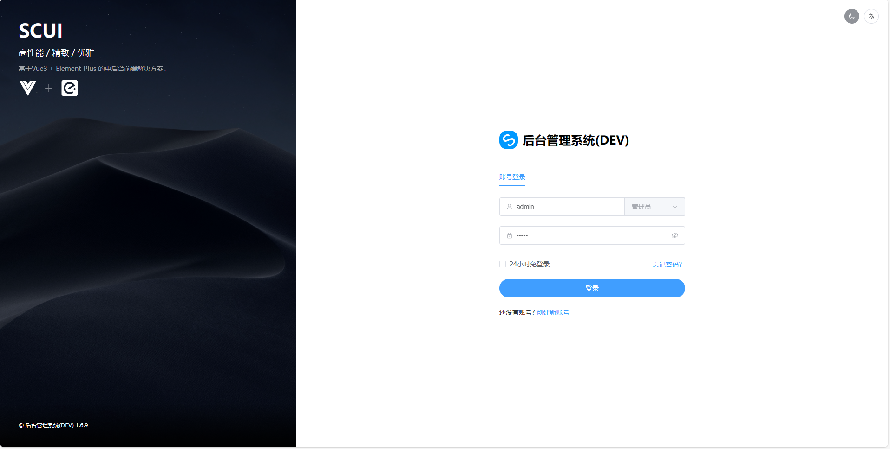
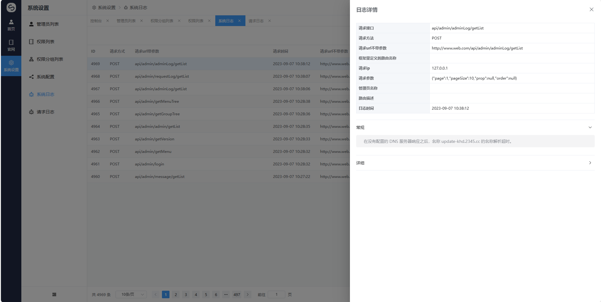

# CMS, enterprise official website general PHP management system

[中文文档](./README.md)

## Framework introduction
[Goravel](https://github.com/goravel/goravel)    
[SCUI](https://gitee.com/lolicode/scui)

### Back-end development component
go 1.20     
Goravel 1.13     

### Front-end development component
scui 1.6.9      
node v14.21.3       

### effect picture

