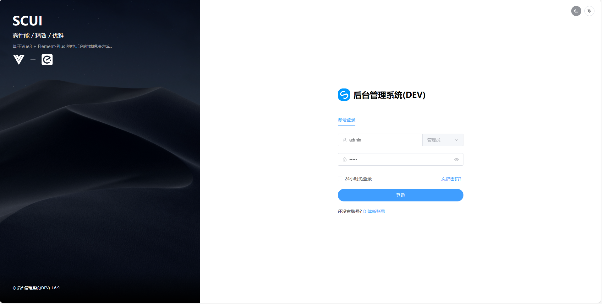
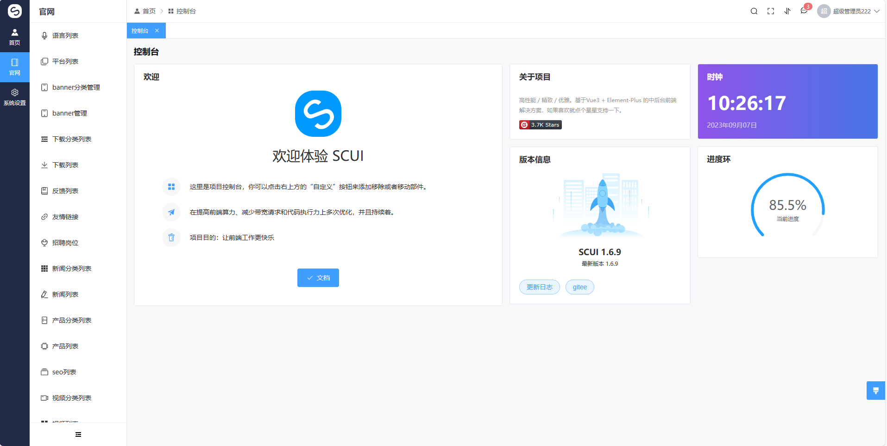
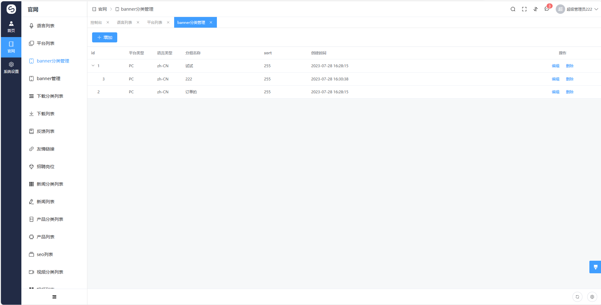
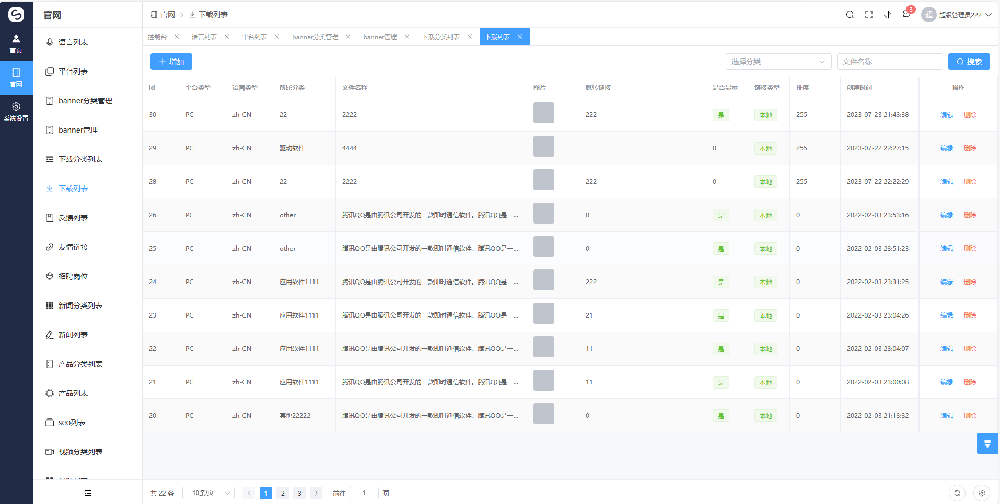
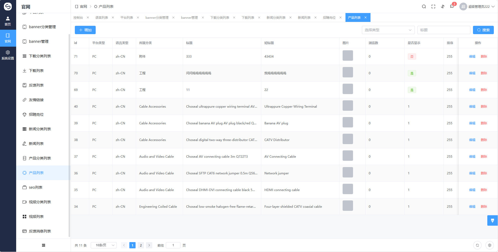
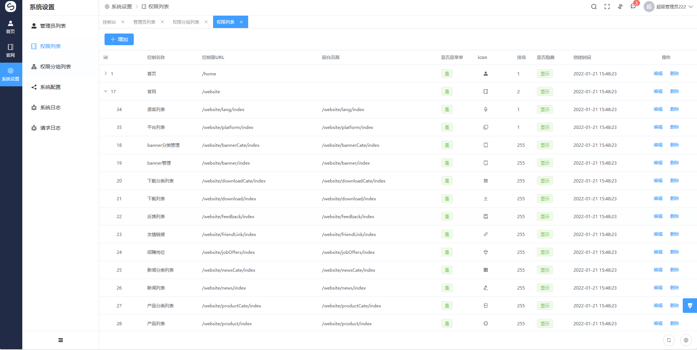
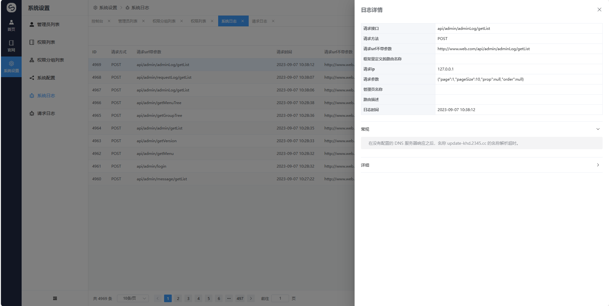

# CMS，企业官网通用Golang后台管理系统

[English doc](./README.en.md)  

## 框架介绍
[Goravel](https://github.com/goravel/goravel)    
[SCUI](https://gitee.com/lolicode/scui)

### 后端开发组件
go 1.20     
Goravel 1.13    

### 数据库 sql(使用最新日期文件)
`goravel\doc\sql_bak` 
mysql 8.0
系统默认账号密码： admin/admin

### 前端开发组件
scui 1.6.9      
node v14.21.3       

### curd 工具
https://gitee.com/open-php/php-code-generator  
https://github.com/zh7314/php-code-generator

### 效果图

